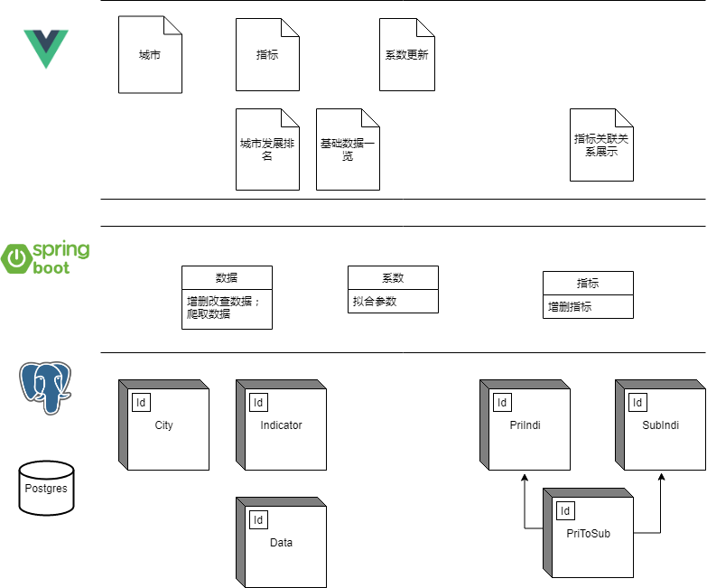
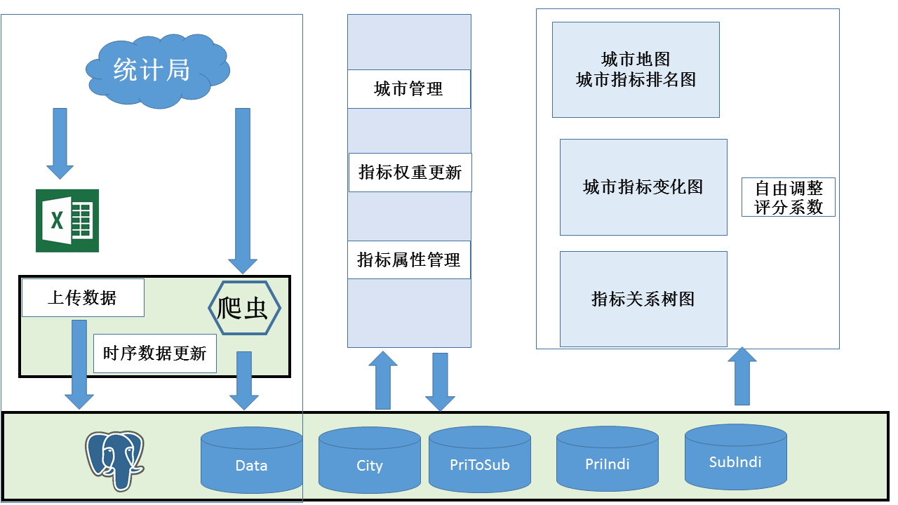
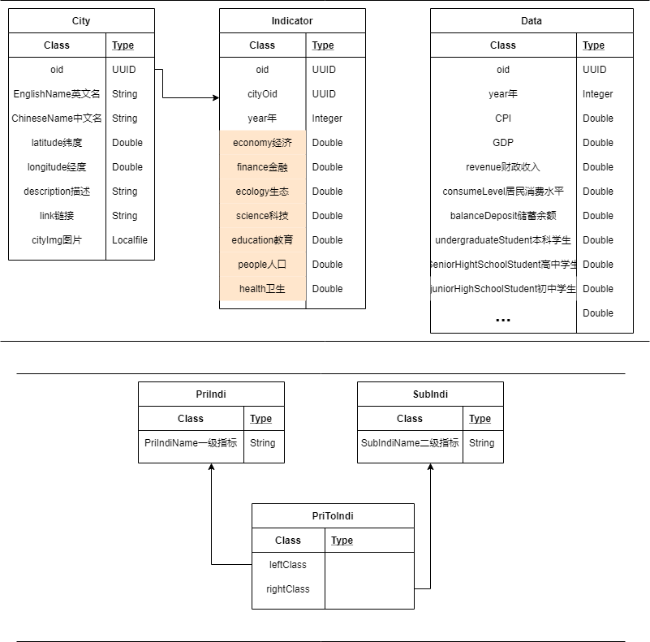
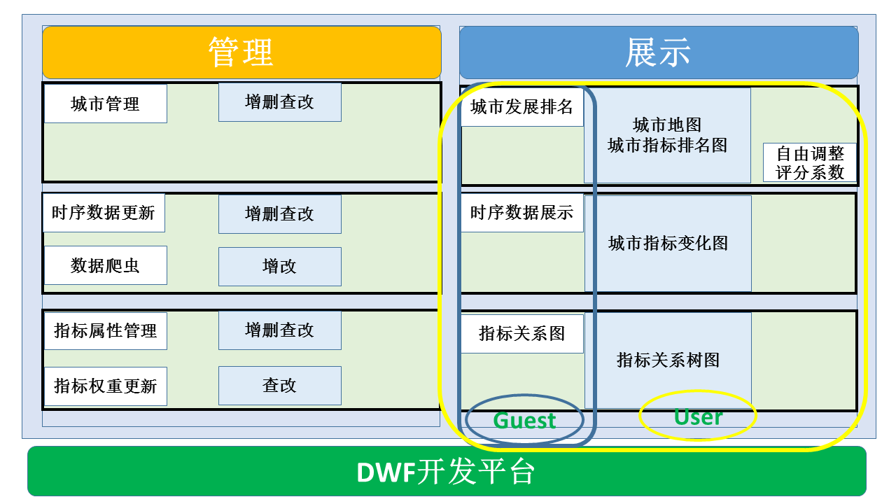

# 城市数据可视化与分析系统
## 系统
DWF
+ 后端设计包括
    - 组织模型: 用户管理
    - 数据模型：数据库表
+ postgresql只是存储 时序数据库的链接,时序那边的元数据由iotdb产生

## 表设计的计划
### 用户管理
+ admin:
+ user
+ guest
### 数据表
+ 城市

|city|Position|Name|Intro|
|-|-|-|-|
|Peking|0|北京|北京|

+ 变化量(考虑使用timeseries)

|time|gdp|finacial|population|employee|income|education|house|
|-|-|-|-|-|-|-|-|
|2012|8888|0|88|60%|33|78%|1.3|

**变化量数据库中存储oid？Name.删除后是否删除该数据库字段**
+ 删除：增加负担
+ 不删除：再次增加，oid需要重新更新，是否需要加入name
参数调整：需要表单，可选中数据进行计算
评分更新：导入数据后自动依赖更新

经济：
+ gdp, 城镇居民消费水平,城镇居民消费水平指数(CPI),财政收入 
+ 物价

金融
+ 储蓄年末余额，
+ 地方公共预算收入与支出
+ 上市公司数量，社会融资规模

科技：

教育：
+ 高等教育学校，中等教育学校，
### 数据来源调研
[知乎](https://zhuanlan.zhihu.com/p/25130679)
[上海统计年鉴](http://tongji.cnki.net/kns55/navi/YearBook.aspx?id=N2017120310&floor=1###)
[北京统计年鉴](http://tongji.cnki.net/kns55/navi/YearBook.aspx?id=N2019010235&floor=1)
[中国统计信息网](http://www.tjcn.org/)
### 中国统计局Api调研
数据地图:
http://data.stats.gov.cn/mapdata.htm?m=mapDataHandle&dbcode=fsyddt&wd=reg&zbId=&sjval=
http://data.stats.gov.cn/mapdata.htm?m=dateHandle&dbcode=fsyddt&wd=sj&sjval=last1000
dbcode=fsyddt&wd=reg&zbId=A0201&sjval=201506

[简书http爬取](https://www.jianshu.com/p/9827a052da91)
[github爬取](https://zuzhaoye.github.io/blog/scrap_javascript/)

查询按钮:http://data.stats.gov.cn/adv.htm?cn=E0101:292

http://data.stats.gov.cn/adv.htm?m=advquery&cn=E0101

找到查询按钮和easyquery之间跳转与参数传递关系

调研状况：
+ http://www.mytju.com/classcode/tools/messyCodeRecover.asp
+ windows-1252	UTF-8编码的中文

模拟提交的表单中json

[{"wd":"zb","zb":["A0101"],"name":["国内生产总值"]},{"wd":"reg","zb":["110000","310000","340100","350200"],"name":["北京","上海","合肥","厦门"]}]

表单做post操作

<form id="advQueryForm" action="/adv.htm?m=advquery&amp;cn=E0105" method="post">
    
document.getElementById("c").value = jsonStr;
document.getElementById("advQueryForm").action = url;

直接fetch疑似有跨域问题，无法得到正确的返回值
```js
fetch("http://data.stats.gov.cn/adv.htm?m=advquery&cn=E0105", {method: 'POST', mode:'cors', headers:{'Content-Type': 'application/json'},redirect:'follow',referrerPolicy:'no-referrer',body:JSON.stringify([{"wd":"zb","zb":["A0101"],"name":["国内生产总值"]},{"wd":"reg","zb":["110000","310000","340100","350200"],"name":["北京","上海","合肥","厦门"]}])}).then(data=>{console.log(data)})
```
在`http://data.stats.gov.cn/`下执行可以获得`ReadableStream`
```
url="http://data.stats.gov.cn/adv.htm?m=advquery&cn=E0105"
param=[{"wd":"zb","zb":["A0101"],"name":["国内生产总值"]},{"wd":"reg","zb":["110000","310000","340100","350200"],"name":["北京","上海","合肥","厦门"]}]
function Post(URL, PARAMTERS) {
         var temp_form = document.createElement("form");
         temp_form.action = URL;
         temp_form.method = "post";
         temp_form.style.display = "none";
         var opt = document.createElement("textarea");
         opt.name = "c";
         opt.value = PARAMTERS;
         document.body.appendChild(temp_form);
         temp_form.submit();
     }
Post(url, param)
```
## Issue
- [x] 网页预览
- [ ] 爬虫程序
- [x] 超级控件使用
- [x] 后端更新评分
- [ ] 前端刷新评分
- [ ] 二级编辑功能报错
- [ ] 后端执行脚本更新系数
- [ ] 合理的指标关系展示

## 代办事项
1.系统（技术）架构：图+文



整个应用基于DWF开发，DWF(Tsinghua DataWay Framework)是采用了模型驱动的设计理念、以配置方式实现业务系统的构建，是以数据为中心的零代码或低代码开发平台，因此整体的系统架构与使用的技术完全来自于DWF。
数据库基于`PostgreSQL`构造了应用需要的六张表，包括`City`,`Indicator`,`Data`,`PriIndi`,`SubIndi`,`PriToSub`,分别对应于城市信息，评价指标，时序数据，一级指标，二级指标，指标关系类。
后端基于`SpringBoot`，采用后端脚本实现了数据库的增删查改，包括后端拟合参数并回填数据库。同时计划采用后端脚本实现爬虫的功能，从而动态更新数据库中的内容。
前端基于`vue`，布局以及控件基本上使用DWF中的已有模块实现，通过DWF内部的对象数据绑定功能，实现了大部分数据交互。同时使用了前端脚本提供了不同表单之间数据的动态响应。前端页面主要包括管理页面和展示页面两大类，其中管理页面有：城市信息管理，评价指标管理，时序数据管理；展示页面有：评价排名，指标排名，指标关系。

2.系统（业务）流场：图+文

原始数据来自于统计局，一共有两种方式，从统计局下载数据之后存成xlsx格式后，上传至DWF平台；在DWF平台调用后端脚本抓取数据，更新到数据库中。第二种方法更为合适，可以做到实时更新，而不必多经过一步下载的文件IO。

数据管理对于数据库中的城市信息和时序信息可以进行微调，指标管理可以对数据库中的一级指标，二级指标以及关系类进行调整，指标系数计算可以更新数据库中的系数以及评分。这部分对数据库包含读和写操作。

展示部分从数据库中读出信息，以不同形式展示。此外该部分不会对数据库进行写操作。
3.数据模型：图+文



基于应用的功能，应用需要存储不同城市在不同时间对应的属性(如GDP,CPI)值，同时需要存储对应的评分值。
数据部分将非时序的`City城市信息`作为一张表单独存储，键值信息包括英文名称，中文名称，位置，图片，介绍。时序信息存储在`Data时序信息`表中，包括GDP,CPI等。根据`Data`表计算的评分值同样属于时序数据，存入`Indicator指标`表中，包括经济，生态，人口，教育，科技，卫生。
指标之间的关系使用三张表储存，分别为`PriIndi`,`SubIndi`,`PriToSub`，对应于一级指标，二级指标，指标关系类。一级指标，二级指标中主要存储指标的名称，应用到指标关系类中。

4.分析模型：公式+文

5.组织权限：表+文

用户组一共划分为Admin, User,Guest。其中Admin权限最高，可以操作和查看所有的页面；User能查看展示页面，以及在展示页面进行与后端无关的操作；Guest仅能查看展示页面。
6.关键技术：公式+文
